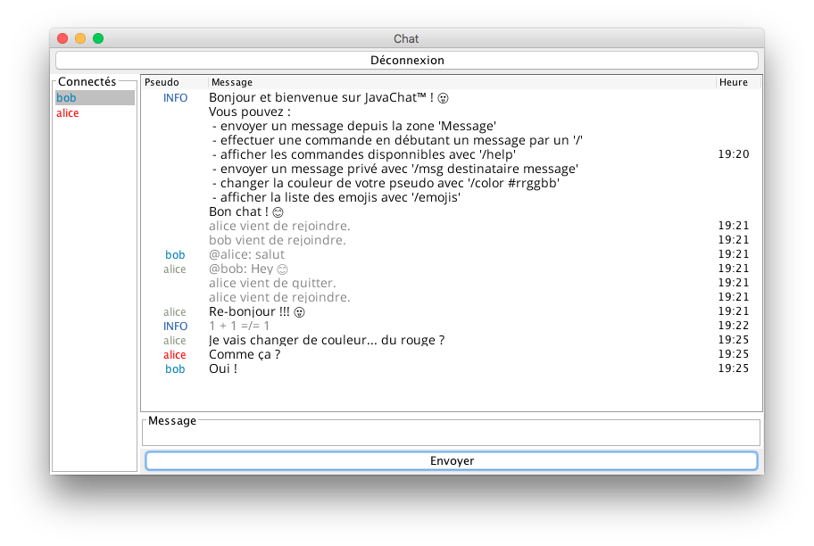

# JavaChat



## Installation
```shell
git clone https://github.com/valentinp72/JavaChat.git
# or with ssh:
# git clone git@github.com:valentinp72/JavaChat.git
cd JavaChat
```

## Compilation
```shell
make
```

## Run the server
```shell
# with the default IP and port:
make serverStart

# with an other IP and port:
make serverStart ARGS="127.0.0.1 9908"
```

## Run a client
```shell
make clientStart
```
